The DOT language
================
Pierce Edmiston

# 

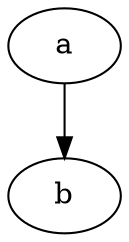

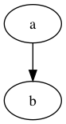<!-- -->

# 

[Node shapes](https://graphviz.gitlab.io/_pages/doc/info/shapes.html)

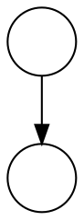

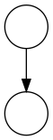<!-- -->

# 

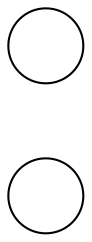

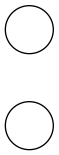<!-- -->

# 

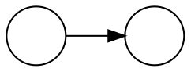

<!-- -->

# 


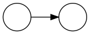<!-- -->

# 

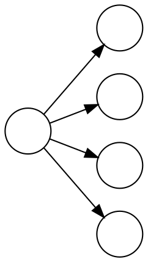

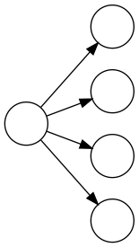<!-- -->

# 

``` dot
graph {
  rankdir=LR;
  layout=circo;
  node[shape=circle label=""];
  a -- {b, c, d, e};
}
```

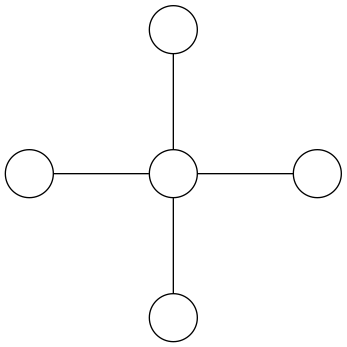<!-- -->

# 

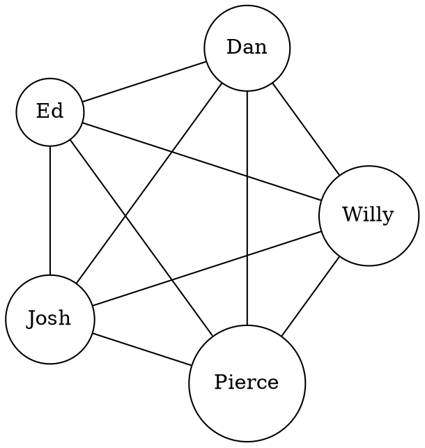

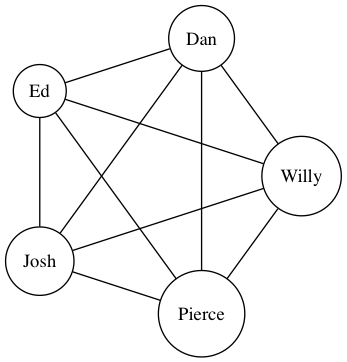<!-- -->

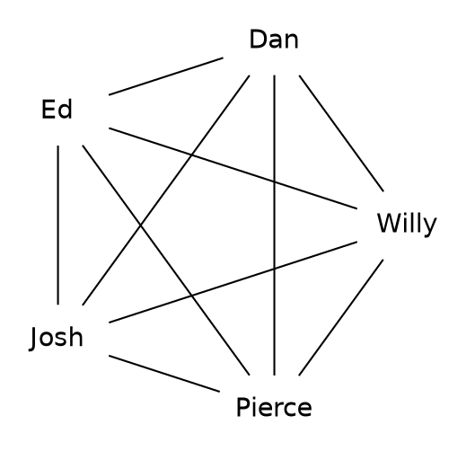

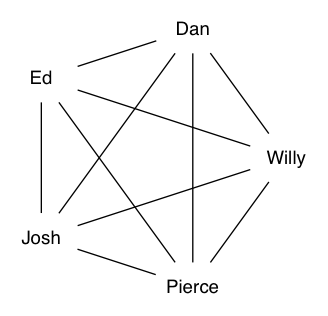<!-- -->

# 

[Graph, Node, Edge
attrs](https://graphviz.gitlab.io/_pages/doc/info/attrs.html)

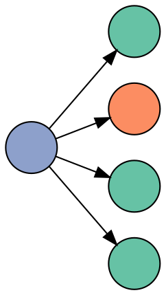

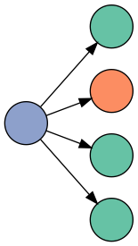<!-- -->

# 

[James’s sklearn
talk](https://jrbourbeau.github.io/madpy-ml-sklearn-2018/#/0/24)

``` dot
from sklearn import datasets
from sklearn.tree import DecisionTreeClassifier, export_graphviz
import graphviz

# ...

def plot_decision_tree(model: DecisionTreeClassifier):
    iris = datasets.load_iris()
    dot_data = export_graphviz(model, out_file=None,
                               feature_names=iris.feature_names[:2],
                               class_names=iris.target_names,
                               impurity=False,
                               filled=True,
                               rounded=True,
                               special_characters=True)
    graph = graphviz.Source(dot_data)
    return graph
```

# 

[Visualizing Wikipedia article revision
history](https://github.com/evoapps/wikivision/blob/master/notebooks/visualizing-article-histories.ipynb),
[graph
function](https://github.com/evoapps/wikivision/blob/master/wikivision/view.py#L21)

``` dot
def graph(edges, nodes=None, remove_labels=False):
    """Create a revision history Digraph from a pandas DataFrame."""
    g = graphviz.Digraph(graph_attr={'rankdir': 'LR'})

    if nodes is None:
        labels = set(edges.iloc[:, 0]).union(set(edges.iloc[:, 1]))
        nodes = pd.DataFrame({'name': list(labels), 'label': list(labels)})

    node_data = nodes.to_dict('index')
    for _, attrs in node_data.items():
        if remove_labels:
            attrs['label'] = ''
        g.node(**attrs)

    g.edges([(from_node, to_node) for _, (from_node, to_node) in edges.iterrows()])

    return g
```
