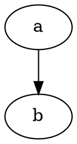
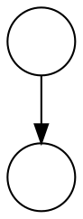
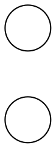
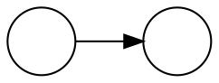
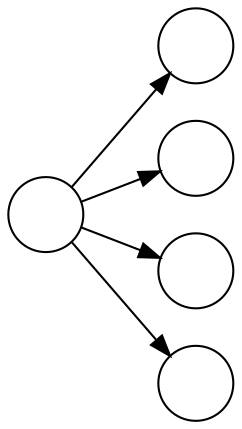
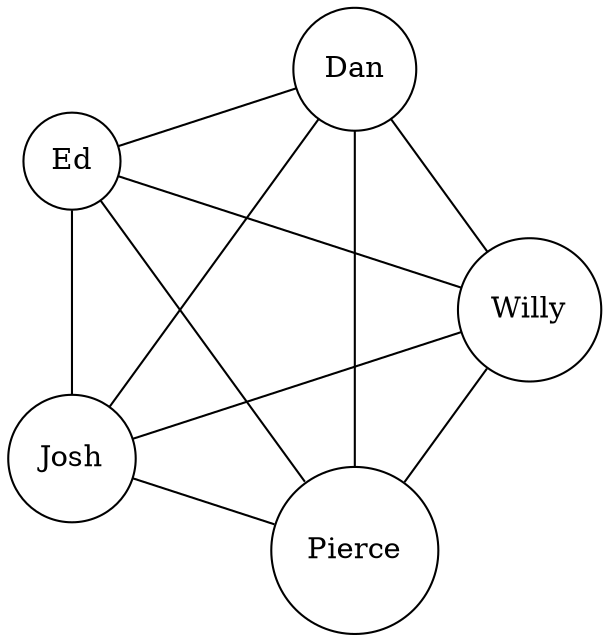
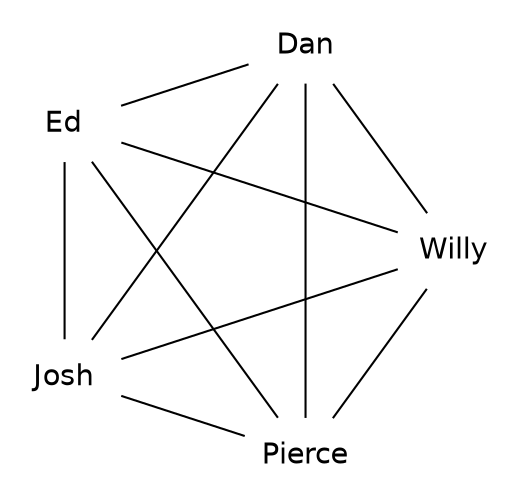
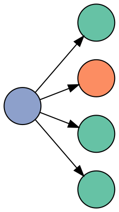

The DOT language
================
Pierce Edmiston



<!-- -->



<!-- -->



<!-- -->



<!-- -->


<!-- -->



<!-- -->

``` dot
graph {
  rankdir=LR;
  layout=circo;
  node[shape=circle label=""];
  a -- {b, c, d, e};
}
```

<!-- -->



<!-- -->



<!-- -->



<!-- -->

[James’s sklearn
talk](https://jrbourbeau.github.io/madpy-ml-sklearn-2018/#/0/24)

``` dot
from sklearn import datasets
from sklearn.tree import DecisionTreeClassifier, export_graphviz
import graphviz

# ...

def plot_decision_tree(model: DecisionTreeClassifier):
    iris = datasets.load_iris()
    dot_data = export_graphviz(model, out_file=None,
                               feature_names=iris.feature_names[:2],
                               class_names=iris.target_names,
                               impurity=False,
                               filled=True,
                               rounded=True,
                               special_characters=True)
    graph = graphviz.Source(dot_data)
    return graph
```
